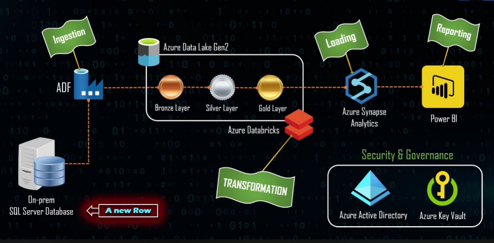
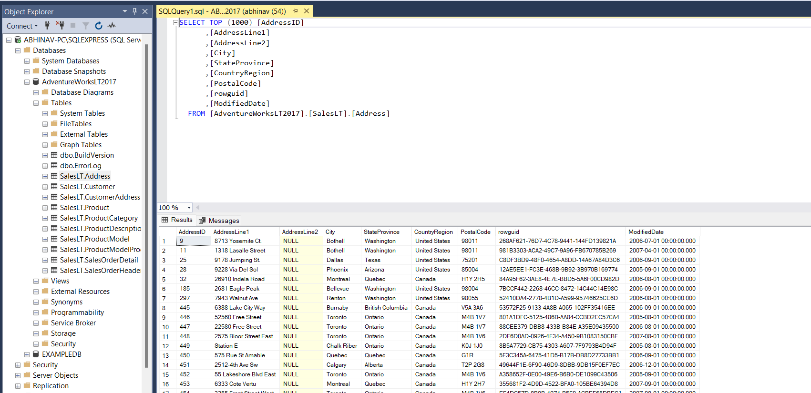
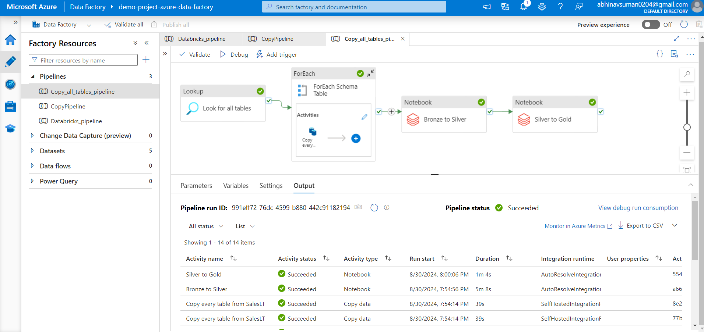
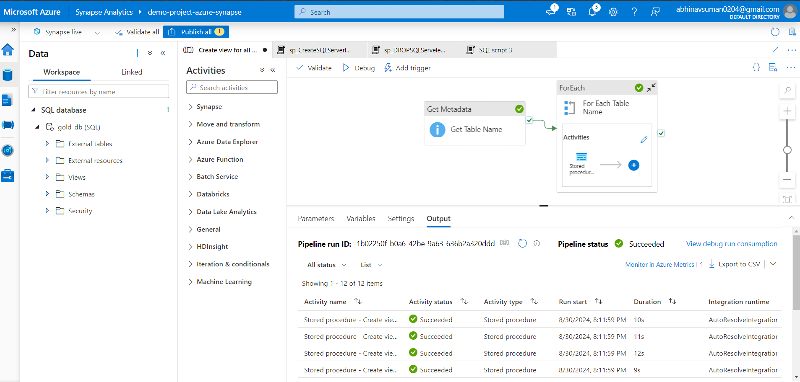
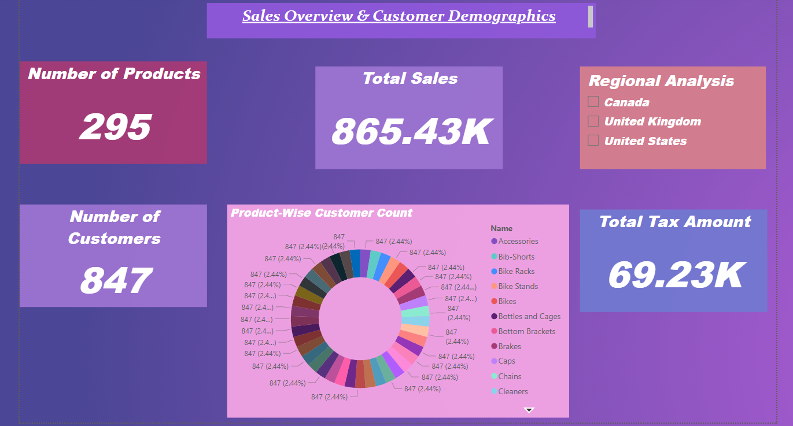

# Azure-DataFactory-Databricks-Synapse-PowerBI-End-to-End-Project

## Overview

This project demonstrates the creation of a comprehensive data platform, encompassing data ingestion, transformation, loading, and reporting. The architecture is designed to efficiently manage data flow from an on-premises SQL Server database to an interactive Power BI dashboard.

## Tools and Technologies

The following Azure services and tools are utilized in this project:

1. **Azure Data Factory**: For orchestrating data movement from on-premises to the cloud.
2. **Azure Data Lake Storage Gen2**: For storing raw and processed data.
3. **Azure Databricks**: For transforming raw data into a clean, usable format.
4. **Azure Synapse Analytics**: For loading and querying the transformed data.
5. **Azure Key Vault**: For managing secrets and keys securely.
6. **Azure Active Directory (AAD)**: For security and governance.
7. **Microsoft Power BI**: For creating interactive dashboards and reports.

## Project Use Case

The project aims to build an end-to-end data solution by:

- Ingesting tables from an on-premises SQL Server database using Azure Data Factory.
- Storing the ingested data in Azure Data Lake Storage Gen2.
- Transforming raw data into a refined format using Azure Databricks.
- Loading the transformed data into Azure Synapse Analytics.
- Creating interactive dashboards in Power BI, integrated with Azure Synapse Analytics.
- Utilizing Azure Active Directory and Azure Key Vault for monitoring and governance.

## Repository Contents

The repository includes the following notebooks and images:

### Notebooks

- **StorageMount**: Instructions for mounting Azure Data Lake Storage in Databricks.
- **Bronze to Silver**: Transformation processes from raw (Bronze) to refined (Silver) data.
- **Silver to Gold**: Further refinement from Silver to Gold data layers.

### Images

1. **Project Architecture**:  
   

2. **On-Premise Data on SQL Server**:  
   

3. **Moving Data from On-Prem to Cloud - Azure Data Factory**:  
   

4. **Creating Views Using Stored Procedure in Synapse**:  
   

5. **Creating an Interactive Dashboard in Power BI**:  
   

This project showcases the integration of various Azure services to create a robust data platform, ensuring efficient data management and insightful reporting.
